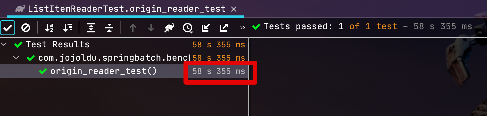
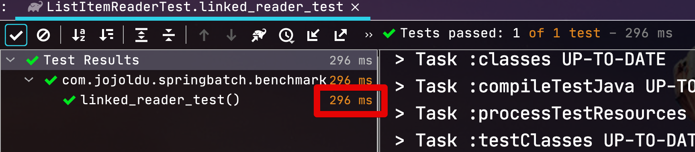

# ListItemReader Performance Benchmark

```java
@Nullable
@Override
public T read() {
    if (!list.isEmpty()) {
        return list.remove(0);
    }
    return null;
}
```

## ArrayList ItemReader (Origin)

```java
public ListItemReader(List<T> list) {
    // If it is a proxy we assume it knows how to deal with its own state.
    // (It's probably transaction aware.)
    if (AopUtils.isAopProxy(list)) {
        this.list = list;
    }
    else {
        this.list = new ArrayList<>(list);
    }
}
```



## LinkedList ItemReader (New)

```java
public LinkedListItemReader(List<T> list) {
    // If it is a proxy we assume it knows how to deal with its own state.
    // (It's probably transaction aware.)
    if (AopUtils.isAopProxy(list)) {
        this.list = list;
    }
    else {
        this.list = new LinkedList<>(list);
    }
}
```
