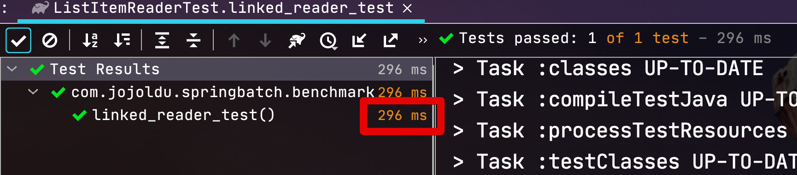

# ListItemReader 사용시 주의 사항

Spring Batch를 사용하다보면 종종 ```ListItemReader``` 가 필요한 경우가 종종 있습니다.  
  
> 물론 일반적으로는 ListItemReader를 사용하기 보다는 FlatFileItemReader, JdbcItemReader, MongoItemReader 등 Spring Batch에서 공식적으로 지원하는 ItemReader나 Custom ItemReader등을 만들어 사용하는 것을 추천합니다.

다만, 현재 Spring Batch의 ```ListItemReader```에서는 성능 이슈가 하나 있는데요.  
이번 시간에는 해당 성능 이슈가 무엇인지, 어떻게 해결할 수 있는지 간단하게 소개 드리겠습니다.  

## 문제 상황

다음과 같은 테스트 코드를 구현해서 실행해봅니다.

```java
@ExtendWith(MockitoExtension.class)
public class ListItemReaderTest {
    private List<String> list = new ArrayList<>();
    private final int size = 1_000_000;

    @BeforeEach
    void setUp() {
        for (int i = 0; i < size; i++) {
             list.add("a");
        }
    }

    @Test
    void origin_reader_test() throws Exception {
        //given
        ListItemReader<String> reader = new ListItemReader<>(list);

        //when
        for (int i = 0; i < size; i++) {
            reader.read();
        }
    }
}
```

* 100만건의 문자열을 ```ListItemReader``` 를 통해 ```read()``` 호출

실제 ListItemReader의 경우 DB/API 등을 통한 **병목현상이 없는** 단순한 코드인데요.  
데이터가 많긴 하지만, 실제로 크게 성능 이슈가 될만한 여지는 없는 테스트 코드입니다.  
해당 코드의 실행 결과는 어떻게 될까요?


무려 **78초**가 수행되었습니다.  
  
단순 문자열을 반복해서 가져오기만 했는데 78초나 걸린것인데요.  
어떤 코드가 문제였을까요?  

## 문제 원인

테스트에 사용된 ```ListItemReader```의 ```read()``` 메소드를 확인해보시면 아래와 같은 코드를 볼 수 있는데요.

```java
@Nullable
@Override
public T read() {
    if (!list.isEmpty()) {
        return list.remove(0);
    }
    return null;
}
```

여기서 문제가 되는 코드가 바로 ```list.remove(0)``` 입니다.  
대부분 아시겠지만, 이 List의 인덱스를 통한 ```remove()``` 는 List의 종류에 따라 작동 방식이 다른데요.

* ```ArrayList```
  * 인덱스를 찾는데 시간 복잡도: ```O(1)``` 
  * 해당 인덱스의 값을 제거한 후 나머지 요소를 이동시키는데 전체 ```O(N)``` 시간 복잡도 발생
* ```LinkedList```
  * 인덱스를 찾는데 시간 복잡도: ```O(N)``` (순차적으로 접근해야되서) 
  * 요소를 제거할때는 포인터만 수정하면 됨

그래서 실제로 두 List는 서로 필요한 장소가 다릅니다.

* ```ArrayList``` 는 검색이 많은 곳
  * 해당 값을 제거한 후, 전체 값들의 이동이 필요하여 삭제 할때 들어가는 리소스가 많습니다.
* ```LinkedList``` 는 삽입 및 삭제 작업이 많은 곳


> 좀 더 자세한 비교는 [dzone - performance-analysis-of-arraylist-and-linkedlist](https://dzone.com/articles/performance-analysis-of-arraylist-and-linkedlist-i)을 참고해보세요.

ListItemReader의 경우 ```List.get()```을 통해 특정값을 찾는 기능은 없으며, **무조건 첫번째 인덱스의 값을 삭제 및 반환**하는 기능만 지원합니다.  
즉, LinkedList를 사용하기에 아주 적절한 상황인 것이죠.  
  
여기서 한가지 의문이 있으실텐데, 그럼 ListItemReader에 LinkedList를 넣어주면 되지 않냐 라고 하실 수 있습니다.  
하지만 ListItemReader는 **생성자로 넣어준 List를 ArrayList로 다시 Wrapping**해서 사용합니다.

```java
public ListItemReader(List<T> list) {
    // If it is a proxy we assume it knows how to deal with its own state.
    // (It's probably transaction aware.)
    if (AopUtils.isAopProxy(list)) {
        this.list = list;
    }
    else {
        this.list = new ArrayList<>(list);
    }
}
```

그러다보니 **생성자에 인자로 LinkedList를 넣어줘도 성능 향상이 없습니다**

```java
@Test
void origin_reader_LinkedList_test() throws Exception {
    //given
    List<String> linkedList = new LinkedList<>(list);
    ListItemReader<String> reader = new ListItemReader<>(linkedList);

    //when
    for (int i = 0; i < size; i++) {
        reader.read();
    }
}
```

(LinkedList를 생성자 인자로 넣어준 테스트 코드)


(LinkedList를 생성자 인자로 넣어준 테스트 코드 결과)  
  
그래서 이 문제를 해결하기 위해서는 **별도의 ListItemReader를 사용**하는 것이 가장 심플한 방법입니다.

## 문제 해결

새롭게 만들 ListItemReader의 코드는 다음과 같습니다.  
(이름을 ListItemReader와의 중복을 피하기 위해 ```LinkedListItemReader```로 지었습니다.)  

```java
public class LinkedListItemReader<T> implements ItemReader<T> {

    private List<T> list;

    public LinkedListItemReader(List<T> list) {
        // If it is a proxy we assume it knows how to deal with its own state.
        // (It's probably transaction aware.)
        if (AopUtils.isAopProxy(list)) {
            this.list = list;
        }
        else {
            this.list = new LinkedList<>(list); // ArrayList -> LinkedList
        }
    }

    @Nullable
    @Override
    public T read() {
        if (!list.isEmpty()) {
            return list.remove(0);
        }
        return null;
    }
}
```

> ```ListItemReader``` 를 상속 (```extends```) 를 할까 하다가 ```ListItemReader```가 **기본 생성자가 없어서** 무조건 ```super(list)``` 형태로 생성자 구현이 필요하여 코드 그대로 복사해서 새로 만들었습니다.


새롭게 만든 ```LinkedListItemReader```를 통해 다시 테스트 코드를 수행해보겠습니다.

```java
@Test
void linked_reader_test() throws Exception {
    //given
    LinkedListItemReader<String> reader = new LinkedListItemReader<>(list);

    //when
    for (int i = 0; i < size; i++) {
        reader.read();
    }
}
```

결과는?



**78초** -> **0.296**초만에 수행 되었습니다.  
성능 차이가 말도 안되는 것을 확인할 수 있습니다.

> 물론 1만건이하의 소량의 데이터를 쓴다면 큰 차이는 없을거라 봅니다.  

## 마무리

일단 위 코드는 분명히 문제라 생각되어서 아래와 같이 Spring Batch 프로젝트에 PR을 보내었는데요.

* [Replace the list used internally by the ListItemReader (ArrayList -> LinkedList)](https://github.com/spring-projects/spring-batch/pull/3783)

이게 Merge된다해도 Spring Batch 4.3 버전 이상부터 반영될 수 있어서 그 하위 버전에서는 사실 위와 같이 직접 클래스 생성해서 사용하는게 낫습니다.  

> 혹시나 PR 과정에서 제가 생각하지 못했던 이슈가 있다면 지속적으로 반영해놓겠습니다. 