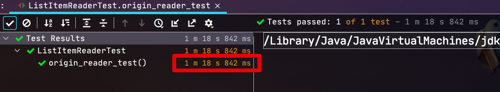

# ListItemReader 사용시 주의 사항

Spring Batch를 사용하다보면 종종 ```ListItemReader``` 가 필요한 경우가 종종 있습니다.  
  
> 물론 일반적으로는 ListItemReader를 사용하기 보다는 FlatFileItemReader, JdbcItemReader, MongoItemReader 등 Spring Batch에서 공식적으로 지원하는 ItemReader나 Custom ItemReader등을 만들어 사용하는 것을 추천합니다.

다만, 현재 Spring Batch의 ```ListItemReader```에서는 성능 이슈가 하나 있는데요.  
이번 시간에는 해당 성능 이슈가 무엇인지, 어떻게 해결할 수 있는지 간단하게 소개 드리겠습니다.  


* [dzone - performance-analysis-of-arraylist-and-linkedlist](https://dzone.com/articles/performance-analysis-of-arraylist-and-linkedlist-i)


ListItemReader uses ```list.remove()``` in the ```read()``` method.
```list.remove()``` works inefficiently in arrayList.

```java
@Nullable
@Override
public T read() {
    if (!list.isEmpty()) {
        return list.remove(0);
    }
    return null;
}
```

Compare this with the test code.  
  
### TestCode


## LinkedListItemReader

```java

```

## 테스트

사용할 테스트 코드는 아래와 같습니다.  

> 명확한 성능 차이를 비교하기 위해 100만건의 ```String``` 값을 등록한 List로 비교합니다.

```java
@ExtendWith(MockitoExtension.class)
public class ListItemReaderTest {
    private List<String> list = new ArrayList<>();
    private final int size = 1_000_000;

    @BeforeEach
    void setUp() {
        for (int i = 0; i < size; i++) {
             list.add("a");
        }
    }

    @Test
    void origin_reader_test() throws Exception {
        //given
        ListItemReader<String> reader = new ListItemReader<>(list);

        //when
        for (int i = 0; i < size; i++) {
            reader.read();
        }
    }

    @Test
    void linked_reader_test() throws Exception {
        //given
        LinkedListItemReader<String> reader = new LinkedListItemReader<>(list);

        //when
        for (int i = 0; i < size; i++) {
            reader.read();
        }
    }
}
```

### Result 1. ArrayList ItemReader (Origin)

```java
public ListItemReader(List<T> list) {
    // If it is a proxy we assume it knows how to deal with its own state.
    // (It's probably transaction aware.)
    if (AopUtils.isAopProxy(list)) {
        this.list = list;
    }
    else {
        this.list = new ArrayList<>(list);
    }
}
```



### Result 2. LinkedList ItemReader (New)

```java
public LinkedListItemReader(List<T> list) {
    // If it is a proxy we assume it knows how to deal with its own state.
    // (It's probably transaction aware.)
    if (AopUtils.isAopProxy(list)) {
        this.list = list;
    }
    else {
        this.list = new LinkedList<>(list);
    }
}
```

